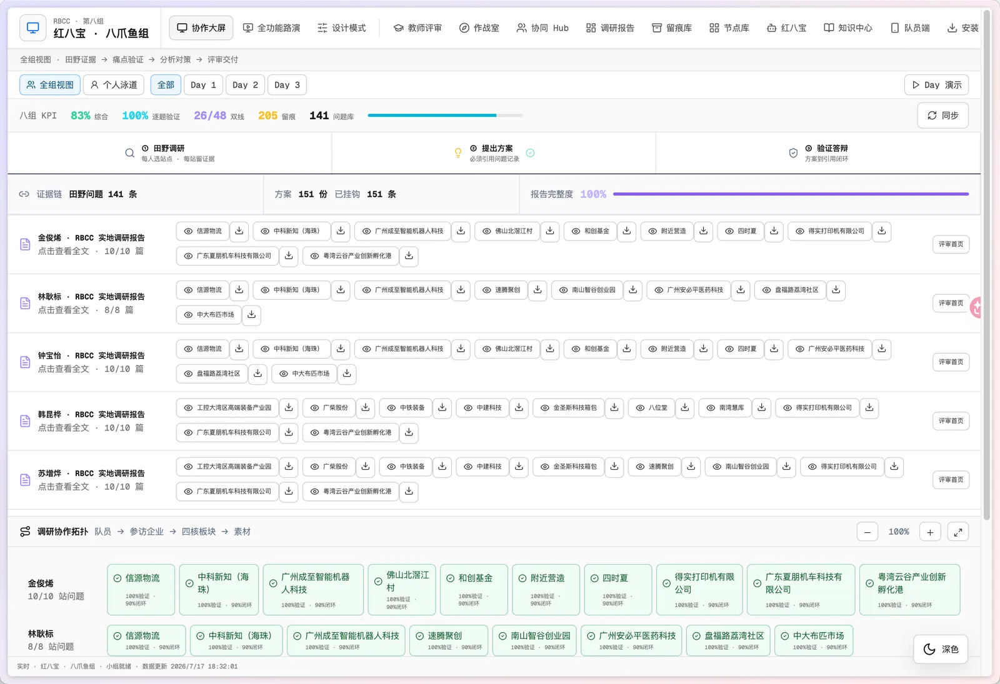
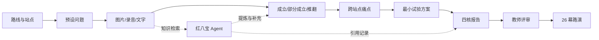
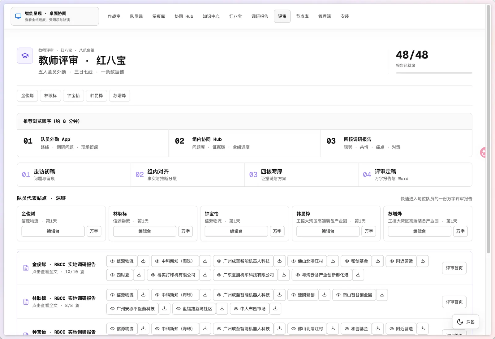
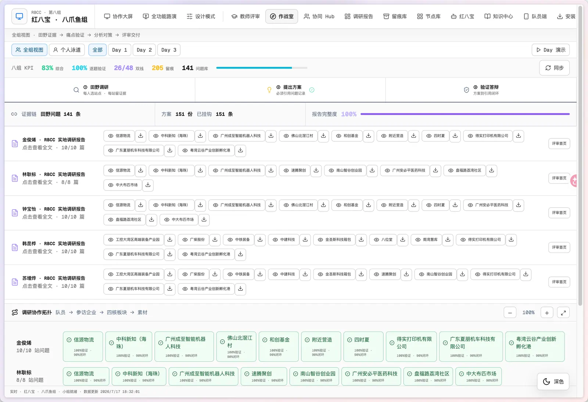
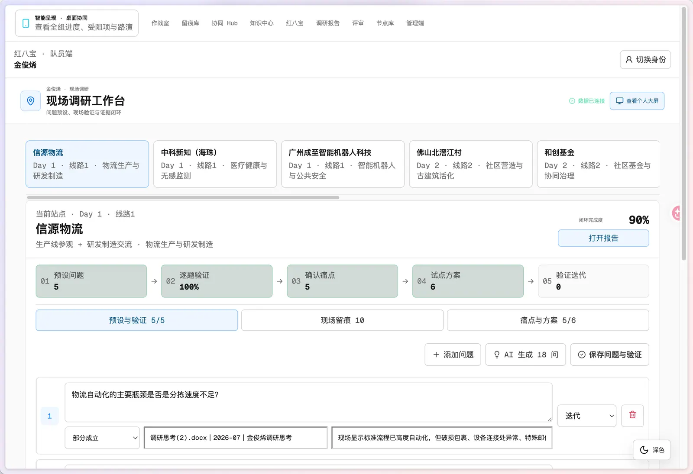
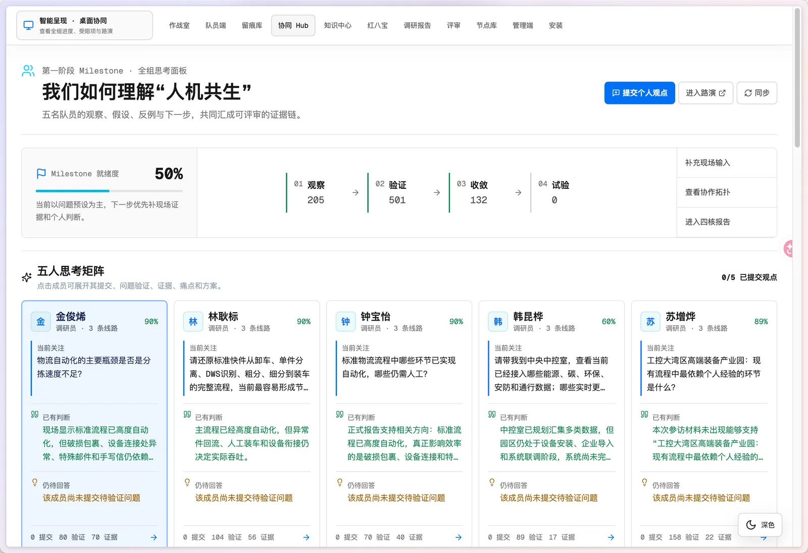
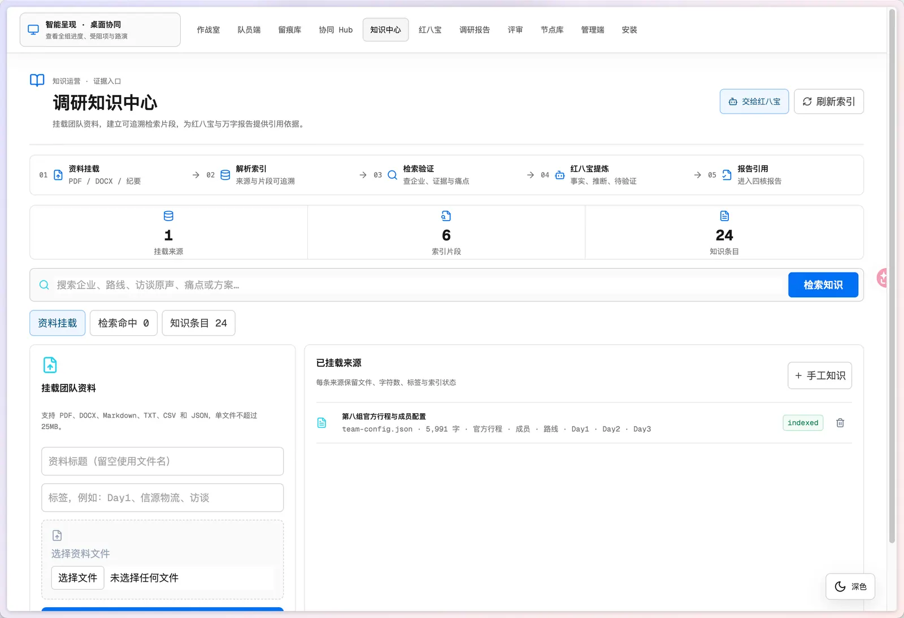
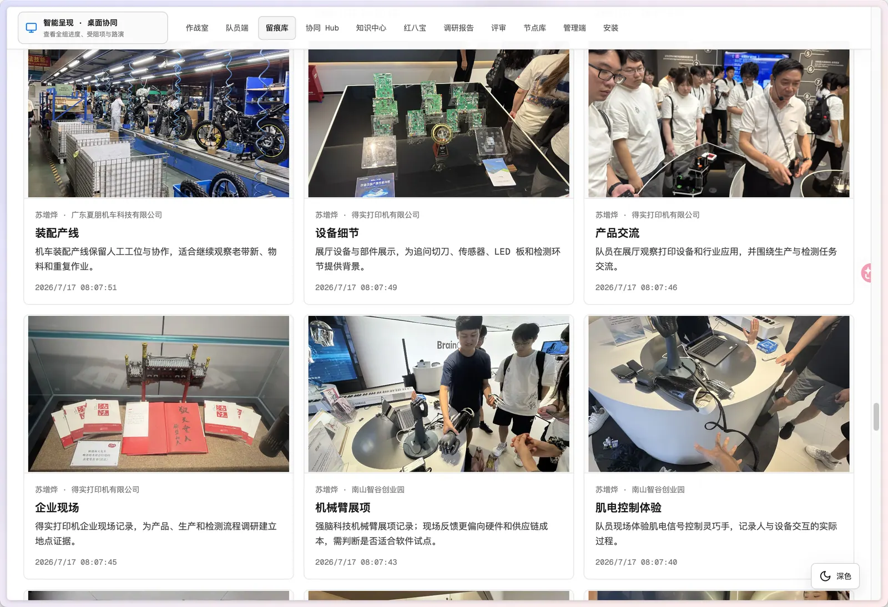
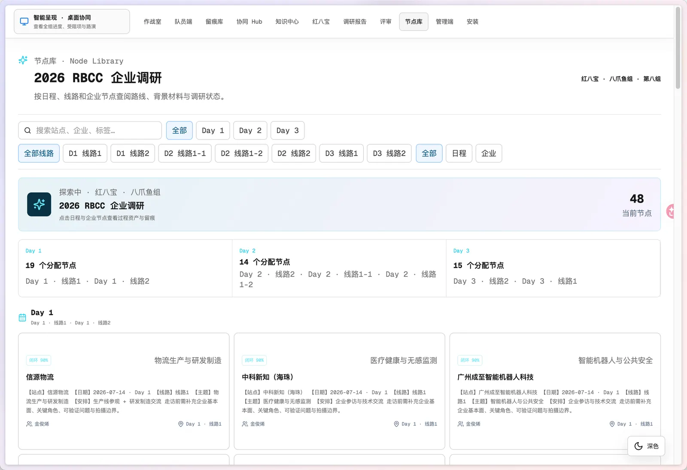
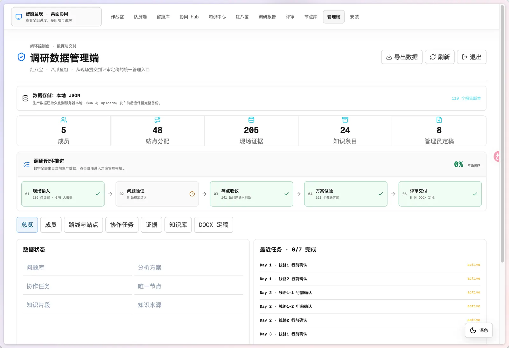

# RBCC Research

<div align="center">

**把一次分散的现场调研，变成可验证、可协作、可汇报的研究闭环。**

RBCC 2026 人机共生调研协作与成果汇报系统

[在线体验](https://rbcc.caiths.com) · [使用文档](https://github.com/poboll/rbcc-research/wiki) · [版本发布](https://github.com/poboll/rbcc-research/releases) · [问题反馈](https://github.com/poboll/rbcc-research/issues)

[](https://github.com/poboll/rbcc-research/releases)
[](LICENSE)
[](https://rbcc.caiths.com)
[](https://nodejs.org/)

</div>



## 为什么做这个产品

一次跨城市、跨线路的企业调研，真正困难的不是“收集更多材料”，而是让五个人在有限时间内形成同一条可信故事线：问题从哪里来，现场看到了什么，哪些假设成立，痛点是否有证据，方案如何被验证，最后又怎样进入报告与汇报。

传统工作流通常散落在聊天记录、相册、录音、在线文档和 PPT 中。材料很多，但缺少上下文；结论很快，但难以回到证据；汇报完成后，过程经验也无法复用。RBCC Research 因此把调研设计成一条可追溯的数据链：

```text
预设问题 -> 现场留痕 -> 验证结论 -> 痛点收敛 -> 方案试验 -> 四核报告 -> 教师评审 -> 26 幕路演
```

它不是一个“替人写报告”的生成器，而是一套让人和 Agent 共同工作的研究基础设施。

## 我的想法

这个产品围绕四个判断构建：

1. **先有证据，再有结论。** 每个判断都应能回到成员、站点、时间、问题和现场材料。
2. **AI 提炼，人来负责。** 红八宝可以发散问题、整理材料和生成结构，但必须区分现场事实、成员推断、模型通识和待验证项。
3. **同一份数据，多种表达。** 队员端、协同大屏、教师评审和路演不是四套内容，而是同一研究状态的不同视图。
4. **展示过程，而不只展示答案。** 里程碑汇报不仅要有结论，还要呈现五名成员如何碰撞、验证、修正和形成共识。

## 产品全景

| 使用者 | 核心任务 | 入口 |
| --- | --- | --- |
| 调研队员 | 维护预设问题、上传图片/录音/文字、填写验证结论 | [`/app`](https://rbcc.caiths.com/app) |
| 小组协作者 | 查看五人思考矩阵、证据缺口、痛点与方案 | [`/collab`](https://rbcc.caiths.com/collab) |
| 管理员 | 管理成员、路线、证据、知识、报告版本和 DOCX 定稿 | [`/admin`](https://rbcc.caiths.com/admin) |
| 教师与汇报人员 | 沿推荐路径评审，并使用 26 幕路演讲解 | [`/review`](https://rbcc.caiths.com/review) |

### 一条真正闭合的调研链路



## 界面预览

<table>
  <tr>
    <td width="50%"><br><b>教师评审</b>：从成员完成度进入证据与报告。</td>
    <td width="50%"><br><b>作战室</b>：把成员、站点、四核板块与素材连接起来。</td>
  </tr>
  <tr>
    <td><br><b>队员端</b>：问题、验证与现场上传在同一上下文完成。</td>
    <td><br><b>协同 Hub</b>：呈现五人思考、共识、分歧和缺口。</td>
  </tr>
  <tr>
    <td><br><b>知识中心</b>：挂载团队资料并提供可检索上下文。</td>
    <td><br><b>留痕库</b>：按人、日期、站点和证据类型筛选。</td>
  </tr>
  <tr>
    <td><br><b>节点库</b>：查看研究链路中的结构化节点。</td>
    <td><br><b>管理端</b>：治理数据、知识、版本与定稿。</td>
  </tr>
</table>

## 核心能力

- **路线化现场工作台**：按成员、日期、线路和企业展示任务，问题支持开拓/迭代标记与四种验证状态。
- **多模态现场留痕**：图片、录音和文字关联采集上下文；图片在浏览器端转 WebP 并压缩后上传。
- **红八宝 Agent**：检索本组知识、问题、证据、痛点和方案；知识库未覆盖时可用模型通识补充，但不会伪装成现场事实。
- **协同与可视化**：全组/个人泳道、五人思考矩阵、真实进度、证据缺口和完整研究拓扑。
- **四核报告**：以现状扫描、人群共情、痛点诊断、分析对策组织材料，并保留引用记录和版本。
- **评审与路演**：教师评审路径、DOCX 定稿下载、26 幕播放/暂停/键盘控制，演示过程只读业务数据。
- **数据治理**：管理员维护路线、成员、问题、证据、知识、方案、报告和定稿，并支持导出备份。

## 技术栈

| 层级 | 技术 | 用途 |
| --- | --- | --- |
| Web | React 19、Vite 6、Lucide React | SPA、响应式界面、深浅主题和图标系统 |
| API | Node.js 20+、ESM、原生 HTTP | 路由、校验、媒体、Agent、报告与管理接口 |
| AI | DeepSeek OpenAI-compatible API | 问题发散、证据提炼、知识问答和报告辅助 |
| 文档 | `docx`、`mammoth`、`pdf-parse` | DOCX 生成、Word/PDF 知识解析 |
| 存储 | 本地 JSON + 文件；或 Vercel Blob JSON | 单节点生产持久化或 Vercel 兼容部署 |
| 部署 | systemd + Nginx；或 Vercel Functions | 自托管生产和快速体验部署 |

### 代码结构

```text
frontend/src/       React 前端源码与页面
src/server/         API、存储、Agent、报告和 DOCX
api/index.mjs       Vercel Functions 入口
data/               初始配置与本地运行状态
docs/wiki/          与 GitHub Wiki 同源的文档
server.mjs          自托管 HTTP 服务入口
vercel.json         Vercel 构建、路由与安全响应头
```

## 快速开始

需要 Node.js 20 或更新版本。

```bash
git clone https://github.com/poboll/rbcc-research.git
cd rbcc-research
npm install
npm run build:frontend
ADMIN_TOKEN="请设置一个强随机令牌" npm start
```

打开 <http://127.0.0.1:4173>。队员端无需登录；管理端打开 `/admin`，输入你在服务端设置的同一 `ADMIN_TOKEN`。

启用 Agent：

```bash
ADMIN_TOKEN="请设置一个强随机令牌" \
DEEPSEEK_API_KEY="你的服务端密钥" \
DEEPSEEK_MODEL="deepseek-v4-flash" \
npm start
```

> [!IMPORTANT]
> 项目没有写死的“管理员默认密码”。管理员凭证就是服务端环境变量 `ADMIN_TOKEN`。不要把生产令牌写入 README、提交到 Git 或发到群聊；忘记时应在服务器环境中重设并重启服务。

完整教程见 [快速开始 Wiki](https://github.com/poboll/rbcc-research/wiki/Getting-Started) 和 [产品使用指南](https://github.com/poboll/rbcc-research/wiki/Product-Guide)。

## 开发与测试

```bash
npm run dev             # 构建前端并监听服务端文件
npm run dev:frontend    # 单独启动 Vite 前端开发服务器
npm run build:frontend  # 生成 web-dist 生产包
npm run check           # 服务端关键文件语法检查
npm test                # 存储、上传文件名、页面与 API 烟测
```

## 部署

### 推荐：Linux 单节点自托管

正式站采用 Nginx 反向代理到 systemd 管理的 Node.js 服务。业务状态写入 `data/app-state.json`，附件写入 `data/uploads/`。发布代码时必须保留生产 `data/`，部署前先备份，部署后核对问题、证据、知识和报告数量。

```text
Browser -> HTTPS/Nginx -> 127.0.0.1:4173 -> Node.js
                                           |-- data/app-state.json
                                           `-- data/uploads/
```

详见 [部署与运维 Wiki](https://github.com/poboll/rbcc-research/wiki/Deployment-and-Operations)。

### Vercel 快速部署

[](https://vercel.com/new/clone?repository-url=https%3A%2F%2Fgithub.com%2Fpoboll%2Frbcc-research&env=ADMIN_TOKEN,DEEPSEEK_API_KEY,DEEPSEEK_MODEL&envDescription=RBCC%20server-side%20configuration&envLink=https%3A%2F%2Fgithub.com%2Fpoboll%2Frbcc-research%2Fwiki%2FDeployment-and-Operations)

一键部署可以立即构建界面和 API，但要保存现场数据，还必须在 Vercel 项目中创建并连接 **private Blob store**，使平台注入 `BLOB_READ_WRITE_TOKEN`。未连接 Blob 时，Functions 只使用易失内存，重新部署或实例回收后数据会丢失。

Vercel Blob JSON 采用整份状态写入，不能提供数据库事务；它适合演示和低并发协作，不适合多人高并发生产。长期运行应迁移 PostgreSQL 与对象存储。

## 运维底线

1. 部署前备份 `data/app-state.json` 和 `data/uploads/`，并记录关键数据数量。
2. 只发布代码和 `web-dist/`，不要运行会覆盖生产状态的种子脚本。
3. 代码异常时回滚代码，不要用旧数据覆盖新数据。
4. `ADMIN_TOKEN`、`DEEPSEEK_API_KEY`、`BLOB_READ_WRITE_TOKEN` 只存在于服务端环境。
5. 健康检查至少覆盖 `/`、`/app`、`/admin`、`/api/team-config` 和一次媒体预览。

## 文档

- [Wiki 首页](https://github.com/poboll/rbcc-research/wiki)
- [为什么与设计原则](https://github.com/poboll/rbcc-research/wiki/Vision-and-Principles)
- [快速开始](https://github.com/poboll/rbcc-research/wiki/Getting-Started)
- [产品使用指南](https://github.com/poboll/rbcc-research/wiki/Product-Guide)
- [系统架构](https://github.com/poboll/rbcc-research/wiki/Architecture)
- [部署与运维](https://github.com/poboll/rbcc-research/wiki/Deployment-and-Operations)
- [安全与管理员访问](https://github.com/poboll/rbcc-research/wiki/Security-and-Admin)
- [故障排查](https://github.com/poboll/rbcc-research/wiki/Troubleshooting)
- [版本与发布](https://github.com/poboll/rbcc-research/wiki/Releases)

## 安全与数据边界

- 管理写接口要求 `x-admin-token`，生产环境未配置 `ADMIN_TOKEN` 时会拒绝管理操作。
- DeepSeek 密钥仅由服务端读取；前端包和业务数据中不应出现密钥。
- AI 输出不自动等于现场证据，报告中的事实应能关联到问题、留痕或知识记录。
- 当前 JSON 存储适合本项目协作规模，不提供多实例事务保证。
- 仓库不包含生产 `app-state.json`、上传附件或任何生产密钥。

## License

本项目采用 [MIT License](LICENSE)。
